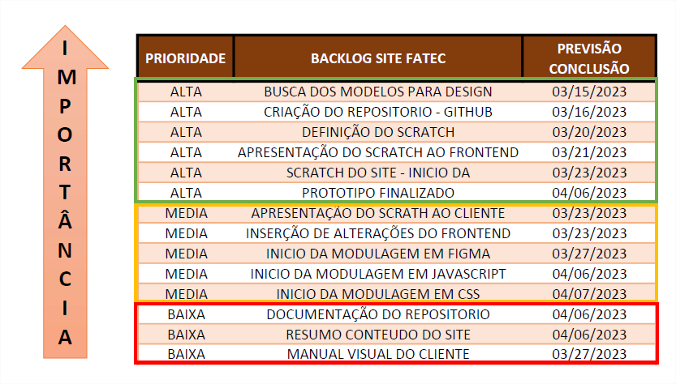

 
 <h1 align="center">Documentação</h1>

<h1>1. Introdução </h1>

<h2>1.1	Descrição</h2>

<h3 text-align="justify">Sistema web mostrando os processos e artefatos da metodologia ágil Scrum com formulário de avaliação.</h3>
 
<h2>1.2	Objetivo</h2>
<h3  text-align="justify">Demonstrar ao usuário a metodologia Scrum de forma que o mesmo possa replicar todos os passos em futuros desenvolvimentos.</h3>
 
<h1>2. Desenvolvimento </h1>
<h2>2.1	Tecnologias utilizadas</h2>
<h3>2.1.1	Tecnologias front-end</h3>
<li>JavaScript, HTML, CSS e Figma. JavaScript, HTML, CSS e Figma.</li>
 
<h3>2.1.2	Tecnologias para versionamento e comunicação</h3>
<li>Github e VS Code.</li>
 
<h3>2.1.3	Tecnologias para gerenciamento do time</h3>
<li>Microsoft Teams e grupo privado whats app.</li>
<h2>2.1.4	Levantamento de requisitos</h2>
<text-align="justify">O time enviou ao Product Owner via Teams as atividades que estariam aptos a executar e o mesmo as organizou, acrescentou mais itens que achou adequado e efetuou a montagem do Product Backlog priorizado onde foram selecionadas as funcionalidades feitas durante a primeira sprint</text-align>

 

<h2>2.1.5	Planejamento das sprints</h2>
A primeira sprint foi feita considerando os requisitos, prazos e ordem de prioridade.

<h2>2.1.6	Arquitetura front-end</h2>

<text-align="justify">Primeiro foi efetuado um esboço simples desenhado a mão para se ter uma ideia inicial do que seria feito no desenvolvimento do site.</text-align>

 

<h2>2.1.7	Arquitetura front-end</h2>

<h1>3. Conclusão </h1>

 

